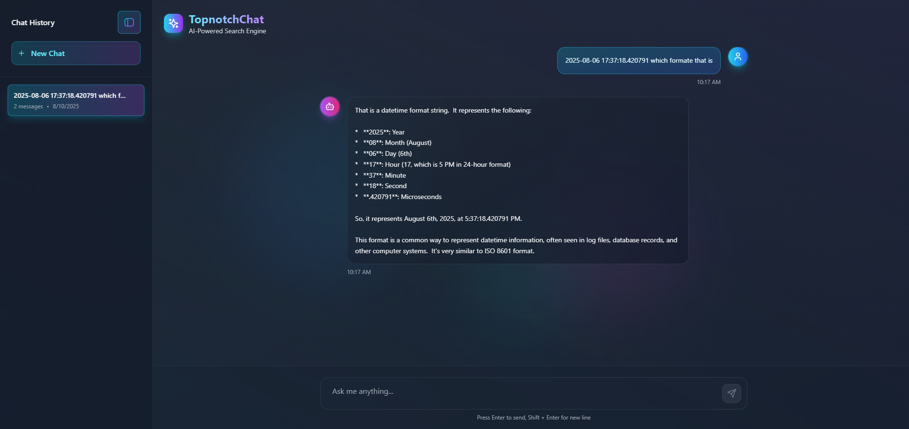

# TopnotchChat - AI-Powered Search Engine



> **Note**: Please save your application screenshot as `screenshot.png` in the project root directory to display the interface preview above.

## 🌟 Overview

TopnotchChat is a modern, AI-powered search engine built with React, TypeScript, and Vite. It features a clean, responsive interface with chat-style interactions powered by Google's Gemini AI model. The application provides an intuitive way to search and get intelligent responses with conversation history management.

## ✨ Features

- **AI-Powered Responses**: Integrated with Google Gemini 2.0 Flash model for intelligent search results
- **Chat Interface**: Clean, modern chat-style interface with message bubbles
- **Conversation History**: Save and manage multiple conversation sessions
- **Dark Theme**: Beautiful dark mode interface with gradient backgrounds
- **Responsive Design**: Fully responsive design that works on all devices
- **Real-time Loading**: Animated loading indicators for better user experience
- **Sidebar Navigation**: Collapsible sidebar for easy conversation management
- **Background Effects**: Animated background gradients for visual appeal

## 🚀 Technology Stack

- **Frontend**: React 18 + TypeScript
- **Build Tool**: Vite
- **Styling**: Tailwind CSS
- **Icons**: Lucide React
- **HTTP Client**: Axios
- **AI Model**: Google Gemini 2.0 Flash
- **Linting**: ESLint with TypeScript support

## 📦 Installation

1. **Clone the repository**:
   ```bash
   git clone https://github.com/Farukcoder/search-engine.git
   cd search-engine
   ```

2. **Install dependencies**:
   ```bash
   npm install
   ```

3. **Set up environment variables**:
   - Get your Google Gemini API key from [Google AI Studio](https://makersuite.google.com/app/apikey)
   - Update the API key in `src/services/gemini.ts`

4. **Start the development server**:
   ```bash
   npm run dev
   ```

5. **Open your browser** and navigate to `http://localhost:5173`

## 🛠️ Available Scripts

- `npm run dev` - Start the development server
- `npm run build` - Build for production
- `npm run preview` - Preview the production build
- `npm run lint` - Run ESLint for code quality checks

## 📁 Project Structure

```
src/
├── components/          # Reusable UI components
│   ├── BackgroundEffect.tsx    # Animated background gradients
│   ├── CustomHistoryIcon.tsx   # Custom history icon component
│   ├── LoadingDots.tsx         # Loading animation component
│   ├── MessageBubble.tsx       # Chat message display component
│   ├── Sidebar.tsx             # Navigation sidebar component
│   └── ThemeToggle.tsx         # Theme switching component
├── hooks/              # Custom React hooks
│   └── useTheme.ts     # Theme management hook
├── services/           # API and external services
│   └── gemini.ts       # Google Gemini AI integration
├── App.tsx             # Main application component
├── types.ts            # TypeScript type definitions
├── main.tsx            # Application entry point
└── index.css           # Global styles and Tailwind imports
```

## 🔧 Configuration

### Tailwind CSS
The project uses Tailwind CSS for styling. Configuration can be found in `tailwind.config.js`.

### TypeScript
TypeScript configuration is split across multiple files:
- `tsconfig.json` - Base TypeScript configuration
- `tsconfig.app.json` - Application-specific settings
- `tsconfig.node.json` - Node.js specific settings

### Vite
Build tool configuration is in `vite.config.ts` with React plugin support.

## 🌐 API Integration

The application integrates with Google's Gemini AI model through the Generative Language API. The integration handles:

- Content generation requests
- Error handling and retry logic
- Response formatting for chat interface
- API key management

## 🎨 UI/UX Features

- **Modern Design**: Clean, minimalist interface with thoughtful spacing
- **Smooth Animations**: Loading states and transitions for better user experience
- **Responsive Layout**: Adapts to different screen sizes seamlessly
- **Accessibility**: Proper ARIA labels and keyboard navigation support
- **Visual Feedback**: Clear visual indicators for user actions

## 📱 Responsive Design

The application is fully responsive and optimized for:
- Desktop computers (1024px and above)
- Tablets (768px - 1023px)
- Mobile devices (below 768px)

## 🔮 Future Enhancements

- [ ] User authentication and personalized experiences
- [ ] Export conversation history
- [ ] Multiple AI model support
- [ ] Voice input/output capabilities
- [ ] Search history analytics
- [ ] Custom themes and appearance settings
- [ ] Conversation sharing functionality

## 🤝 Contributing

1. Fork the repository
2. Create your feature branch (`git checkout -b feature/AmazingFeature`)
3. Commit your changes (`git commit -m 'Add some AmazingFeature'`)
4. Push to the branch (`git push origin feature/AmazingFeature`)
5. Open a Pull Request

## 📄 License

This project is licensed under the MIT License - see the [LICENSE](LICENSE) file for details.

## 🙋‍♂️ Support

If you have any questions or need help with setup, please:

1. Check the [Issues](https://github.com/Farukcoder/search-engine/issues) page
2. Create a new issue if your problem isn't already addressed
3. Provide detailed information about your environment and the issue

## 🌟 Acknowledgments

- Google Gemini AI for providing the intelligent search capabilities
- React team for the amazing framework
- Tailwind CSS for the utility-first styling approach
- Lucide React for the beautiful icon set
- Vite for the fast build tool

---

**Made with ❤️ by [Farukcoder](https://github.com/Farukcoder)**
